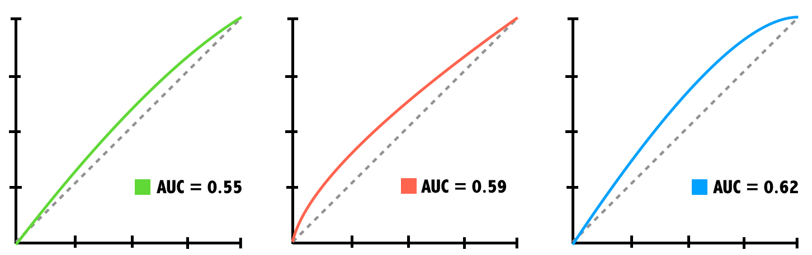

### Question 1: Building simple logistic regression models

**Exercise**

The donors dataset contains 93,462 examples of people mailed in a fundraising solicitation for paralyzed military veterans. The donated column is 1 if the person made a donation in response to the mailing and 0 otherwise. This binary outcome will be the dependent variable for the logistic regression model.

The remaining columns are features of the prospective donors that may influence their donation behavior. These are the model's independent variables.

When building a regression model, it is often helpful to form a hypothesis about which independent variables will be predictive of the dependent variable. The bad_address column, which is set to 1 for an invalid mailing address and 0 otherwise, seems like it might reduce the chances of a donation. Similarly, one might suspect that religious interest (interest_religion) and interest in veterans affairs (interest_veterans) would be associated with greater charitable giving.

In this exercise, you will use these three factors to create a simple model of donation behavior. The dataset donors is available for you to use.

**Instructors**

1. Examine donors using the str() function.
2. Count the number of occurrences of each level of the donated variable using the table() function.
3. Fit a logistic regression model using the formula interface and the three independent variables described above.
    * Call glm() with the formula as its first argument and the data frame as the data argument.
    * Save the result as donation_model.
4. Summarize the model object with summary().

**Pre Code**

```r
# Examine the dataset to identify potential independent variables

# Explore the dependent variable

# Build the donation model
donation_model <- glm(___, data = ___, family = "___")

# Summarize the model results
```

**Ans.**

```r
# Examine the dataset to identify potential independent variables
str(donors)

# Explore the dependent variable
table(donors$donated)

# Build the donation model
donation_model <- glm(donated ~ bad_address + interest_religion + interest_veterans, data = donors, family = "binomial")

# Summarize the model results
summary(donation_model)
```

### Question 2: Making a binary prediction

**Exercise**

In the previous exercise, you used the glm() function to build a logistic regression model of donor behavior. As with many of R's machine learning methods, you can apply the predict() function to the model object to forecast future behavior. By default, predict() outputs predictions in terms of log odds unless type = "response" is specified. This converts the log odds to probabilities.

Because a logistic regression model estimates the probability of the outcome, it is up to you to determine the threshold at which the probability implies action. One must balance the extremes of being too cautious versus being too aggressive. For example, if you were to solicit only the people with a 99% or greater donation probability, you may miss out on many people with lower estimated probabilities that still choose to donate. This balance is particularly important to consider for severely imbalanced outcomes, such as in this dataset where donations are relatively rare.

The dataset donors and the model donation_model are available for you to use.

**Instructions**

1. Use the predict() function to estimate each person's donation probability. Use the type argument to get probabilities. Assign the predictions to a new column called donation_prob.
2. Find the actual probability that an average person would donate by passing the mean() function the appropriate column of the donors data frame.
3. Use ifelse() to predict a donation if their predicted donation probability is greater than average. Assign the predictions to a new column called donation_pred.
4. Use the mean() function to calculate the model's accuracy.

**Pre Code**

```r
# Estimate the donation probability
donors$donation_prob <- predict(___, type = "___")

# Find the donation probability of the average prospect
mean(___)

# Predict a donation if probability of donation is greater than average (0.0504)
donors$donation_pred <- ifelse(___ > 0.0504, ___, ___)

# Calculate the model's accuracy
mean(___ == ___)
```

**Ans.**

```r
# Estimate the donation probability
donors$donation_prob <- predict(donation_model, type = "response")

# Find the donation probability of the average prospect
mean(donors$donated)

# Predict a donation if probability of donation is greater than average
donors$donation_pred <- ifelse(donors$donation_prob > 0.0504, 1, 0)

# Calculate the model's accuracy
mean(donors$donated == donors$donation_pred)
```

### Question 3: The limitations of accuracy

In the previous exercise, you found that the logistic regression model made a correct prediction nearly 80% of the time. Despite this relatively high accuracy, the result is misleading due to the rarity of outcome being predicted.

The donors dataset is available to use. What would the accuracy have been if a model had simply predicted "no donation" for each person?

1. 80%
2. 85%
3. 90%
4. 95%

**Ans.** 4

### Question 4: Calculating ROC Curves and AUC

**Exercise**

The previous exercises have demonstrated that accuracy is a very misleading measure of model performance on imbalanced datasets. Graphing the model's performance better illustrates the tradeoff between a model that is overly aggressive and one that is overly passive.

In this exercise you will create a ROC curve and compute the area under the curve (AUC) to evaluate the logistic regression model of donations you built earlier.

The dataset donors with the column of predicted probabilities, donation_prob, has been loaded for you.

**Instructions**

1. Load the pROC package.
2. Create a ROC curve with roc() and the columns of actual and predicted donations. Store the result as ROC.
3. Use plot() to draw the ROC object. Specify col = "blue" to color the curve blue.
4. Compute the area under the curve with auc().

**Pre Code**

```r
# Load the pROC package

# Create a ROC curve
ROC <- roc(___, ___)

# Plot the ROC curve
plot(___, col = ___)

# Calculate the area under the curve (AUC)
auc(___)
```

**Ans.**

```r
# Load the pROC package
library(pROC)

# Create a ROC curve
ROC <- roc(donors$donated, donors$donation_prob)

# Plot the ROC curve
plot(ROC, col = "blue")

# Calculate the area under the curve (AUC)
auc(ROC)
```

### Question 5: Comparing ROC curves

Which of the following ROC curves illustrates the best model?



1. AUC 0.55
2. AUC 0.59
3. AUC 0.62
4. I need more information!

**Ans.** 4

[Feedback: When AUC values are very close, it's important to know more about how the model will be used.]

### Question 6: Coding categorical features

Sometimes a dataset contains numeric values that represent a categorical feature.

In the donors dataset, wealth_rating uses numbers to indicate the donor's wealth level:

0 = Unknown
1 = Low
2 = Medium
3 = High

This exercise illustrates how to prepare this type of categorical feature and examines its impact on a logistic regression model. The donors data frame is available for you to use.

**Instructions**

1. Create a factor wealth_levels from the numeric wealth_rating with labels as shown above by passing the factor() function the column you want to convert, the individual levels, and the labels.
2. Use relevel() to change the reference category to Medium. The first argument should be your new factor column.
3. Build a logistic regression model using the column wealth_levels to predict donated and display the result with summary().

**Pre Code**

```r
# Convert the wealth rating to a factor
donors$wealth_levels <- ___(___, levels = ___, labels = ___)

# Use relevel() to change reference category
donors$wealth_levels <- ___(___, ref = ___)

# See how our factor coding impacts the model
summary(___)
```

**Ans.**

```r
# Convert the wealth rating to a factor
donors$wealth_levels <- factor(donors$wealth_rating, levels = c(0, 1, 2, 3), labels = c("Unknown", "Low", "Medium", "High"))

# Use relevel() to change reference category
donors$wealth_levels <- relevel(donors$wealth_levels, ref = "Medium")

# See how our factor coding impacts the model
summary(glm(donated ~ wealth_levels, data = donors, family = "binomial"))
```

### Question 7: Handling missing data

**Exercise**

Some of the prospective donors have missing age data. Unfortunately, R will exclude any cases with NA values when building a regression model.

One workaround is to replace, or impute, the missing values with an estimated value. After doing so, you may also create a missing data indicator to model the possibility that cases with missing data are different in some way from those without.

The data frame donors is loaded in your workspace.

**Instructions**

1. Use summary() on donors$age to find the average age of prospects with non-missing data.
2. Use ifelse() and the test is.na(donors$age) to impute the average (rounded to 2 decimal places) for cases with missing age. Be sure to also ignore NAs.
3. Create a binary dummy variable named missing_age indicating the presence of missing data using another ifelse() call and the same test.

**Pre Code**

```r
# Find the average age among non-missing values
summary(___)

# Impute missing age values with the mean age
donors$imputed_age <- ifelse(___)

# Create missing value indicator for age
donors$missing_age <- ___
```

**Ans.**

```r
# Find the average age among non-missing values
summary(donors$age)

# Impute missing age values with the mean age
donors$imputed_age <- ifelse(is.na(donors$age), round(mean(donors$age, na.rm = TRUE), 2), donors$age)

# Create missing value indicator for age
donors$missing_age <- ifelse(is.na(donors$age), 1, 0)
```

### Question 8: Understanding missing value indicators

A missing value indicator provides a reminder that, before imputation, there was a missing value present on the record.

Why is it often useful to include this indicator as a predictor in the model?

1. A missing value may represent a unique category by itself
2. There may be an important difference between records with and without missing data
3. Whatever caused the missing value may also be related to the outcome
4. All of the above

**Ans.** 4

### Question 9: Building a more sophisticated model

**Exercise**

One of the best predictors of future giving is a history of recent, frequent, and large gifts. In marketing terms, this is known as R/F/M:

Recency
Frequency
Money

Donors that haven't given both recently and frequently may be especially likely to give again; in other words, the combined impact of recency and frequency may be greater than the sum of the separate effects.

Because these predictors together have a greater impact on the dependent variable, their joint effect must be modeled as an interaction. The donors dataset has been loaded for you.

**Instructions**

1. Create a logistic regression model of donated as a function of money plus the interaction of recency and frequency. Use * to add the interaction term.
2. Examine the model's summary() to confirm the interaction effect was added.
3. Save the model's predicted probabilities as rfm_prob. Use the predict() function, and remember to set the type argument.
4. Plot a ROC curve by using the function roc(). Remember, this function takes the column of outcomes and the vector of predictions.
5. Compute the AUC for the new model with the function auc() and compare performance to the simpler model.

**Pre Code**

```r
# Build a recency, frequency, and money (RFM) model
rfm_model <- ___

# Summarize the RFM model to see how the parameters were coded


# Compute predicted probabilities for the RFM model
rfm_prob <- ___

# Plot the ROC curve and find AUC for the new model
library(pROC)
ROC <- ___
plot(___, col = "red")
auc(___)
```

**Ans.**

```r
# Build a recency, frequency, and money (RFM) model
rfm_model <- glm(donated ~ recency * frequency + money, data = donors, family = "binomial")

# Summarize the RFM model to see how the parameters were coded
summary(rfm_model)

# Compute predicted probabilities for the RFM model
rfm_prob <- predict(rfm_model, data = donors, type = "response")

# Plot the ROC curve for the new model
library(pROC)
ROC <- roc(donors$donated, rfm_prob)
plot(ROC, col = "red")
auc(ROC)
```

### Question 10: The dangers of stepwise regression

In spite of its utility for feature selection, stepwise regression is not frequently used in disciplines outside of machine learning due to some important caveats. Which of these is NOT one of these concerns?

1. It is not guaranteed to find the best possible model
2. A stepwise model's predictions can not be trusted
3. The stepwise regression procedure violates some statistical assumptions
4. It can result in a model that makes little sense in the real world

**Ans.** 2

### Question 11: Building a stepwise regression model

**Exercise**

In the absence of subject-matter expertise, stepwise regression can assist with the search for the most important predictors of the outcome of interest.

In this exercise, you will use a forward stepwise approach to add predictors to the model one-by-one until no additional benefit is seen. The donors dataset has been loaded for you.

**Instructions**

1. Use the R formula interface with glm() to specify the base model with no predictors. Set the explanatory variable equal to 1.
2. Use the R formula interface again with glm() to specify the model with all predictors.
3. Apply step() to these models to perform forward stepwise regression. Set the first argument to null_model and set direction = "forward". This might take a while (up to 10 or 15 seconds) as your computer has to fit quite a few different models to perform stepwise selection.
4. Create a vector of predicted probabilities using the predict() function.
5. Plot the ROC curve with roc() and plot() and compute the AUC of the stepwise model with auc().

**Pre Code**

```r
# Specify a null model with no predictors
null_model <- ___(___, data = ___, family = "___")

# Specify the full model using all of the potential predictors
full_model <- ___

# Use a forward stepwise algorithm to build a parsimonious model
step_model <- step(___, scope = list(lower = null_model, upper = full_model), direction = "___")

# Estimate the stepwise donation probability
step_prob <- ___

# Plot the ROC of the stepwise model
library(pROC)
ROC <- ___
plot(___, col = "red")
auc(___)
```

**Ans.**

```r
# Specify a null model with no predictors
null_model <- glm(donated ~ 1, data = donors, family = "binomial")

# Specify the full model using all of the potential predictors
full_model <- glm(donated ~ ., data = donors, family = "binomial")

# Use a forward stepwise algorithm to build a parsimonious model
step_model <- step(null_model, scope = list(lower = null_model, upper = full_model), direction = "forward")

# Estimate the stepwise donation probability
step_prob <- predict(step_model, type = "response")

# Plot the ROC of the stepwise model
library(pROC)
ROC <- roc(donors$donated, step_prob)
plot(ROC, col = "red")
auc(ROC)
```

<hr>