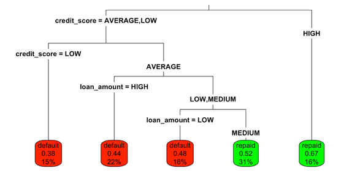
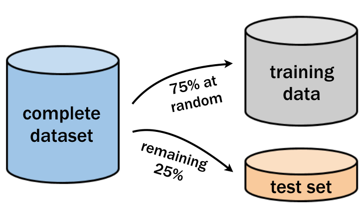

### Question 1: Building a simple decision tree

**Exercise**

The loans dataset contains 11,312 randomly-selected people who applied for and later received loans from Lending Club, a US-based peer-to-peer lending company.

You will use a decision tree to try to learn patterns in the outcome of these loans (either repaid or default) based on the requested loan amount and credit score at the time of application.

Then, see how the tree's predictions differ for an applicant with good credit versus one with bad credit.

The dataset loans has been loaded for you.

**Instructions**

1. Load the rpart package.
2. Fit a decision tree model with the function rpart().
3. Supply the R formula that specifies outcome as a function of loan_amount and credit_score as the first argument.
4. Leave the control argument alone for now. (You'll learn more about that later!)
5. Use predict() with the resulting loan model to predict the outcome for the good_credit applicant. Use the type argument to predict the "class" of the outcome.
6. Do the same for the bad_credit applicant.

**Pre Code**

```r
# Load the rpart package

# Build a lending model predicting loan outcome versus loan amount and credit score
loan_model <- rpart(___, data = ___, method = "___", control = rpart.control(cp = 0))

# Make a prediction for someone with good credit
predict(___, ___, type = "___")

# Make a prediction for someone with bad credit
```

**Ans.**

```r
# Load the rpart package
library(rpart)

# Build a lending model predicting loan outcome versus loan amount and credit score
loan_model <- rpart(outcome ~ loan_amount + credit_score, data = loans, method = "class", control = rpart.control(cp = 0))

# Make a prediction for someone with good credit
predict(loan_model, good_credit, type = "class")

# Make a prediction for someone with bad credit
predict(loan_model, bad_credit, type = "class")
```

### Question 2: Visualizing classification trees

**Exercise**

Due to government rules to prevent illegal discrimination, lenders are required to explain why a loan application was rejected.

The structure of classification trees can be depicted visually, which helps to understand how the tree makes its decisions. The model loan_model that you fit in the last exercise is available to use.

**Instruction**

1. Type loan_model to see a text representation of the classification tree.
2. Load the rpart.plot package.
3. Apply the rpart.plot() function to the loan model to visualize the tree.
4. See how changing other plotting parameters impacts the visualization by running the supplied command.

**Pre Code**

```r
# Examine the loan_model object

# Load the rpart.plot package

# Plot the loan_model with default settings

# Plot the loan_model with customized settings
rpart.plot(loan_model, type = 3, box.palette = c("red", "green"), fallen.leaves = TRUE)
```

**Ans.**

```r
# Examine the loan_model object
loan_model

# Load the rpart.plot package
library(rpart.plot)

# Plot the loan_model with default settings
rpart.plot(loan_model)

# Plot the loan_model with customized settings
rpart.plot(loan_model, type = 3, box.palette = c("red", "green"), fallen.leaves = TRUE)
```

### Question 3: Understanding the tree's decisions

The following image shows the structure of a classification tree predicting loan outcome from the applicant's credit score and requested loan amount.



Based on this tree structure, which of the following applicants would be predicted to repay the loan?

1. Someone with an average credit score and a low requested loan amount.
2. Someone with a low credit score and a medium requested loan amount.
3. Someone with a high requested loan amount and average credit.
4. Someone with a low requested loan amount and high credit.

**Ans.** 4

### Question 4: Why do some branches split?

A classification tree grows using a divide-and-conquer process. Each time the tree grows larger, it splits groups of data into smaller subgroups, creating new branches in the tree.

Given a dataset to divide-and-conquer, which groups would the algorithm prioritize to split first?

1. The group with the largest number of examples.
2. The group creating branches that improve the model's prediction accuracy.
3. The group it can split to create the greatest improvement in subgroup homogeneity.
4. The group that has not been split already.

**Ans.** 3

### Question 5: Creating random test datasets

**Exercise**

Before building a more sophisticated lending model, it is important to hold out a portion of the loan data to simulate how well it will predict the outcomes of future loan applicants.

As depicted in the following image, you can use 75% of the observations for training and 25% for testing the model.



The sample() function can be used to generate a random sample of rows to include in the training set. Simply supply it the total number of observations and the number needed for training.

Use the resulting vector of row IDs to subset the loans into training and testing datasets. The dataset loans is available for you to use.

**Instructions**

1. Apply the nrow() function to determine how many observations are in the loans dataset, and the number needed for a 75% sample.
2. Use the sample() function to create an integer vector of row IDs for the 75% sample. The first argument of sample() should be the number of rows in the data set, and the second is the number of rows you need in your training set.
3. Subset the loans data using the row IDs to create the training dataset. Save this as loans_train.
4. Subset loans again, but this time select all the rows that are not in sample_rows. Save this as loans_test

**Pre Code**

```r
# Determine the number of rows for training


# Create a random sample of row IDs
sample_rows <- sample(___, ___)

# Create the training dataset
loans_train <- loans[___]

# Create the test dataset
loans_test <- loans[___]
```

**Ans.**

```r
# Determine the number of rows for training
nrow(loans) * 0.75

# Create a random sample of row IDs
sample_rows <- sample(nrow(loans), nrow(loans) * 0.75)

# Create the training dataset
loans_train <- loans[sample_rows, ]

# Create the test dataset
loans_test <- loans[-sample_rows, ]
```

### Question 6: Building and evaluating a larger tree

**Exercise**

Previously, you created a simple decision tree that used the applicant's credit score and requested loan amount to predict the loan outcome.

Lending Club has additional information about the applicants, such as home ownership status, length of employment, loan purpose, and past bankruptcies, that may be useful for making more accurate predictions.

Using all of the available applicant data, build a more sophisticated lending model using the random training dataset created previously. Then, use this model to make predictions on the testing dataset to estimate the performance of the model on future loan applications.

The rpart package has been pre-loaded, and the loans_train and loans_test datasets have been created.

**Instructions**

1. Use rpart() to build a loan model using the training dataset and all of the available predictors. Again, leave the control argument alone.
2. Applying the predict() function to the testing dataset, create a vector of predicted outcomes. Don't forget the type argument.
3. Create a table() to compare the predicted values to the actual outcome values.
4. Compute the accuracy of the predictions using the mean() function.

**Pre Code**

```r
# Grow a tree using all of the available applicant data
loan_model <- rpart(___, data = ___, method = "___", control = rpart.control(cp = 0))

# Make predictions on the test dataset
loans_test$pred <- ___

# Examine the confusion matrix
table(___, ___)

# Compute the accuracy on the test dataset
mean(___)
```

**Ans.**

```r
# Grow a tree using all of the available applicant data
loan_model <- rpart(outcome ~ ., data = loans_train, method = "class", control = rpart.control(cp = 0))

# Make predictions on the test dataset
loans_test$pred <- predict(loan_model, loans_test, type = "class")

# Examine the confusion matrix
table(loans_test$pred, loans_test$outcome)

# Compute the accuracy on the test dataset
mean(loans_test$pred == loans_test$outcome)
```

### Question 7: Conducting a fair performance evaluation

Holding out test data reduces the amount of data available for growing the decision tree. In spite of this, it is very important to evaluate decision trees on data it has not seen before.

Which of these is NOT true about the evaluation of decision tree performance?

1. Decision trees sometimes overfit the training data.
2. The model's accuracy is unaffected by the rarity of the outcome.
3. Performance on the training dataset can overestimate performance on future data.
4. Creating a test dataset simulates the model's performance on unseen data.

**Ans.** 2

### Question 8: Preventing overgrown trees

**Exercise**

The tree grown on the full set of applicant data grew to be extremely large and extremely complex, with hundreds of splits and leaf nodes containing only a handful of applicants. This tree would be almost impossible for a loan officer to interpret.

Using the pre-pruning methods for early stopping, you can prevent a tree from growing too large and complex. See how the rpart control options for maximum tree depth and minimum split count impact the resulting tree.

rpart has been pre-loaded.

**Instructions 1/2**

1. Use rpart() to build a loan model using the training dataset and all of the available predictors.
2. Set the model controls using rpart.control() with parameters cp set to 0 and maxdepth set to 6.
3. See how the test set accuracy of the simpler model compares to the original accuracy of 58.3%.
4. First create a vector of predictions using the predict() function.
5. Compare the predictions to the actual outcomes and use mean() to calculate the accuracy.

**Pre Code**

```r
# Grow a tree with maxdepth of 6
loan_model <- ___

# Make a class prediction on the test set
loans_test$pred <- ___

# Compute the accuracy of the simpler tree
mean(___)
```

**Ans.**

```r
# Grow a tree with maxdepth of 6
loan_model <- rpart(outcome ~ ., data = loans_train, method = "class", control = rpart.control(cp = 0, maxdepth = 6))

# Make a class prediction on the test set
loans_test$pred <- predict(loan_model, loans_test, type = "class")

# Compute the accuracy of the simpler tree
mean(loans_test$pred == loans_test$outcome)
```

**Instructions 2/2**

1. In the model controls, remove maxdepth and add a minimum split parameter, minsplit, set to 500.

**Pre Code**

```r
# Swap maxdepth for a minimum split of 500 
loan_model <- rpart(outcome ~ ., data = loans_train, method = "class", control = rpart.control(cp = 0, maxdepth = 6))

# Run this. How does the accuracy change?
loans_test$pred <- predict(loan_model, loans_test, type = "class")
mean(loans_test$pred == loans_test$outcome)
```

**Ans.**

```r
# Swap maxdepth for a minimum split of 500 
loan_model <- rpart(outcome ~ ., data = loans_train, method = "class", control = rpart.control(cp = 0, minsplit = 500))

# Run this. How does the accuracy change?
loans_test$pred <- predict(loan_model, loans_test, type = "class")
mean(loans_test$pred == loans_test$outcome)
```

### Question 9: Creating a nicely pruned tree

**Exercise**

Stopping a tree from growing all the way can lead it to ignore some aspects of the data or miss important trends it may have discovered later.

By using post-pruning, you can intentionally grow a large and complex tree then prune it to be smaller and more efficient later on.

In this exercise, you will have the opportunity to construct a visualization of the tree's performance versus complexity, and use this information to prune the tree to an appropriate level.

The rpart package has been pre-loaded, along with loans_test and loans_train.

**Instructions**

1. Use all of the applicant variables and no pre-pruning to create an overly complex tree. Make sure to set cp = 0 in rpart.control() to prevent pre-pruning.
2. Create a complexity plot by using plotcp() on the model.
3. Based on the complexity plot, prune the tree to a complexity of 0.0014 using the prune() function with the tree and the complexity parameter.
4. Compare the accuracy of the pruned tree to the original accuracy of 58.3%. To calculate the accuracy use the predict() and mean() functions.

**Pre Code**

```r
# Grow an overly complex tree
loan_model <- ___

# Examine the complexity plot
plotcp(___)

# Prune the tree
loan_model_pruned <- ___(___, cp = ___)

# Compute the accuracy of the pruned tree
loans_test$pred <- ___
mean(___)
```

**Ans.**

```r
# Grow an overly complex tree
loan_model <- rpart(outcome ~ ., data = loans_train, method = "class", control = rpart.control(cp = 0))

# Examine the complexity plot
plotcp(loan_model)

# Prune the tree
loan_model_pruned <- prune(loan_model, cp = 0.0014)

# Compute the accuracy of the pruned tree
loans_test$pred <- predict(loan_model_pruned, loans_test, type = "class")
mean(loans_test$pred == loans_test$outcome)
```

### Question 10: Why do trees benefit from pruning?

Classification trees can grow indefinitely, until they are told to stop or run out of data to divide-and-conquer.

Just like trees in nature, classification trees that grow overly large can require pruning to reduce the excess growth. However, this generally results in a tree that classifies fewer training examples correctly.

Why, then, are pre-pruning and post-pruning almost always used?

1. Simpler trees are easier to interpret
2. Simpler trees using early stopping are faster to train
3. Simpler trees may perform better on the testing data
4. All of the above

**Ans.** 4

### Question 11: Understanding random forests

Groups of classification trees can be combined into an ensemble that generates a single prediction by allowing the trees to "vote" on the outcome.

Why might someone think that this could result in more accurate predictions than a single tree?

1. Each tree in the forest is larger and more complex than a typical single tree.
2. Every tree in a random forest uses the complete set of predictors.
3. The diversity among the trees may lead it to discover more subtle patterns.
4. The random forest is not affected by noisy data.

**Ans.** 3

### Question 12: Building a random forest model

**Exercise**

In spite of the fact that a forest can contain hundreds of trees, growing a decision tree forest is perhaps even easier than creating a single highly-tuned tree.

Using the randomForest package, build a random forest and see how it compares to the single trees you built previously.

Keep in mind that due to the random nature of the forest, the results may vary slightly each time you create the forest.

**Instruction**

1. Load the randomForest package.
2. Build a random forest model using all of the loan application variables. The randomForest function also uses the formula interface.
3. Compute the accuracy of the random forest model to compare to the original tree's accuracy of 57.6% using predict() and mean().

**Pre Code**

```r
# Load the randomForest package
___

# Build a random forest model
loan_model <- ___(___, data = ___)

# Compute the accuracy of the random forest
loans_test$pred <- ___
mean(___)
```

**Ans.**

```r
# Load the randomForest package
library(randomForest)

# Build a random forest model
loan_model <- randomForest(outcome ~ ., data = loans_train)

# Compute the accuracy of the random forest
loans_test$pred <- predict(loan_model, loans_test)
mean(loans_test$pred == loans_test$outcome)
```
