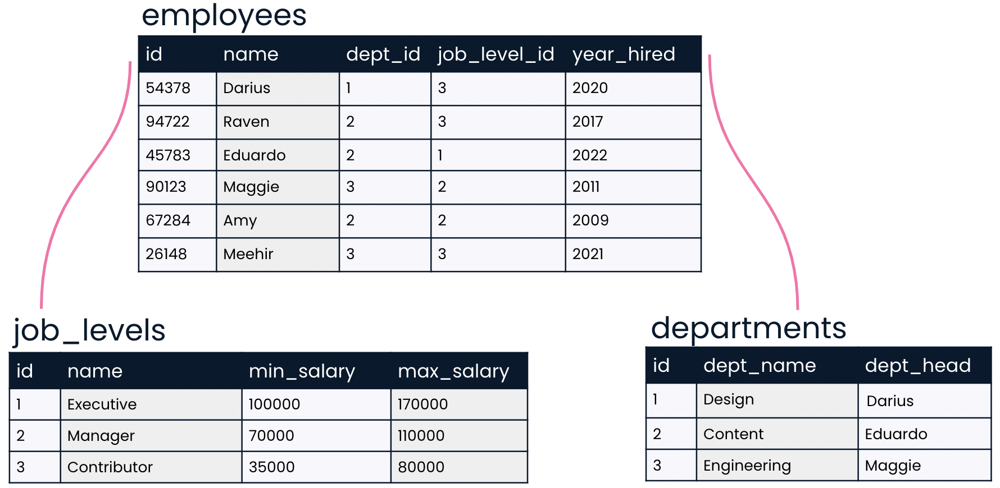
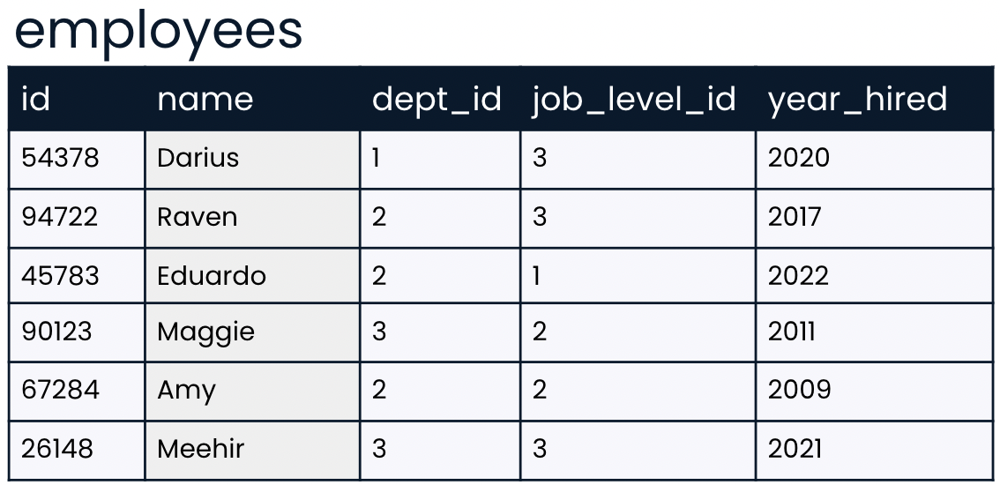
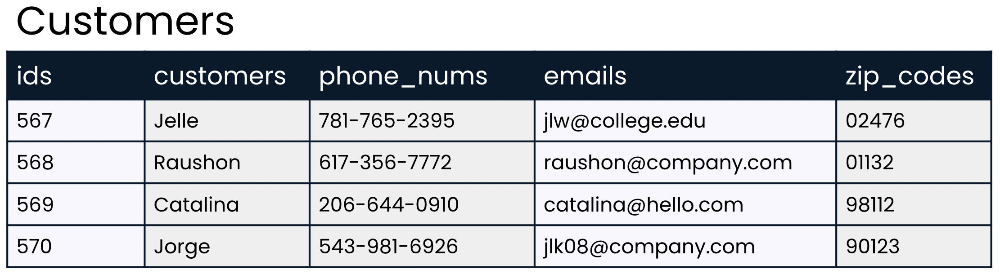

### Practice: Intro to SQL | Chapter 1

#### Question 1 | MCQ-MC

**What are the advantages of databases?**

Imagine you are part of a discussion at work about whether or not to create a database. You've learned about several advantages of storing data in a database rather than other traditional formats like spreadsheets.

See if you can remember what they are by selecting all of the advantages.

1. More storage
2. Many people can use at once
3. Can be secured with encryption
4. Can easily see all data at once
5. Fast and easy setup

**Ans.** 1, 2, 3

#### Question 2 | MCQ-SC

**Data organization**

If you'd like to use SQL to gain insights from data, understanding the organization of a database is an important first step. Take a look at the database below. Which of the following statements correctly describes its organization?

  

1. This is a table containing three relational databases: employees, job_levels, and departments.
2. This is a relational database containing three tables: employees, job_levels, and departments.
3. This is a database, but it is not relational, because no relationship exists between job levels and departments.
4. This is not a database because there is no SQL code shown.

**Ans.** 2

#### Question 3 | MCQ-SC

**Picking a unique ID**

You've learned that a unique identifier is a unique value that identifies a record so that it can be distinguished from other records in the same table.

Let's take a closer look at the employees table. Which of the fields do you think is best suited to be a unique identifier?

  

1. `name`
2. `dept_id`
3. `year_hired`
4. `id`

**Ans.** 4

#### Question 4 | MCQ-MC

**Setting the table in style**

Imagine that you are designing a database and the following table has been suggested. Your task is to provide feedback on how this table could be improved. Use the skills you learned in the last video to critique it!

  

1. The table name should not be capitalized.
2. The table name should be made singular.
3. The `customers` field should be renamed. 
4. The field names should be capitalized.
5. The field names should be made singular.
6. Underscores in the field name should be replaced with spaces.

**Ans.** 1, 3, 5

#### Question 5 | MCQ-SC

**At your service**

Now that you know more about how data is stored, it's time to test those skills!

Select the statement about database storage that is false.

1. Servers can be used for storing website information as well as databases.
2. A server can handle requests from many computers at once.
3. Servers are usually personal computers such as laptopsss
4. Data from a database is physically stored on a server.

**Ans.** 3

#### Question 6 | MCQ-SC

**Finding data types**

Imagine that you are starting a new job and have just started getting to know your new employer's database. You know that it's important to know the data type—such as VARCHAR, INT, or NUMERIC—corresponding to each field in a table. Where could you find this information?

1. You can find this information by looking at each table in the database.
2. You can find this information by looking at a diagram of relationships between tables.
3. You can find this information by looking at the values in each field for each table.
4. You can find this information by looking at a database schema.

**Ans.** 4

#### Question 7 | Bucket

**Choice of type**

You've learned that when a table is created, a data type must be indicated for each field. Choosing the correct data type allows the data to be stored correctly and makes certain operations associated with that data type available. For example, mathematical operations can be performed on NUMERIC and INT data types, but not on VARCHAR data. Thus, it makes sense to store numerical values as NUMERIC or INT so that you can perform math operations on them if needed.

In this exercise, you'll practice selecting the proper data type for your data!

* **VARCHAR**
    * Product reviews written by customers
    * Phone numbers such as 321-123-5555
* **INT**
    * Model year such as 2004
    * Number of subscribers such as 9872
* **NUMERIC**
    * Weight in tons such as 5.67
    * Product prices such as $63.75

