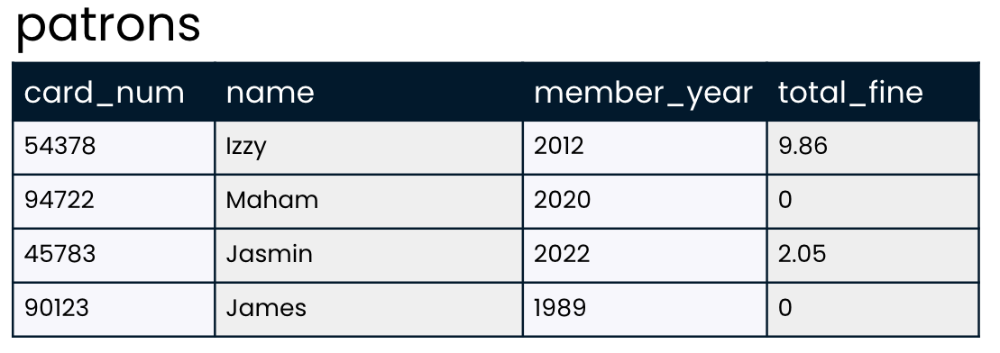
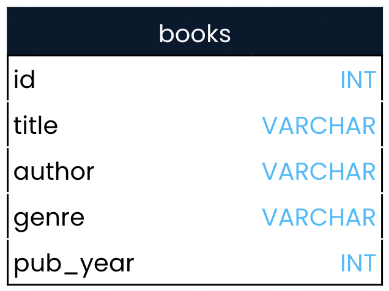

### Practice: Intro to SQL | Chapter 2

#### Question 1 | MCQ-SC

**SQL strengths**

Which of the below scenarios describes a situation in which using SQL would be useful?

1. All data needed to answer the business question is presented in a spreadsheet, and no complicated relationships exist between different data points.
2. Large amounts of data about many different but related areas of a business are housed in a relational database.
3. The data needed to answer the business question doesn't exist yet.

**Ans.** 2

#### Question 2 | MCQ-MC

**Developing SQL style**

Recall from the video that it's important to pay attention to the formatting of SQL queries in order to make them readable. This is especially helpful as you learn more keywords and your queries get longer.

In this exercise, you'll review the below query about the patrons table. This code will run properly, but it is messy and hard to read. Your task is to determine which edits are appropriate to improve the query so that it follows best practices for SQL style.

```sql
SELECT CARD_NUM, TOTAL_FINE 
from patrons
```

Here's a reminder about what the patrons table looks like!


<br><br>

1. Capitalize `from`
2. Make `CARD_NUM` and `TOTAL_FINE` lowercase
3. Add a `;` at the end of the query
4. All code should be on just one line
5. Capitalize `patrons`
6. Make `SELECT` lowercase

**Ans.** 1, 2, 3

#### Question 3 | Coding

**Querying the books table**

You're ready to practice writing your first SQL query using the SELECT and FROM keywords. Recall from the video that SELECT is used to choose the fields that will be included in the result set, while FROM is used to pick the table in which the fields are listed.


<br><br>

**Task 1:** Your task in this exercise is to return all titles from the books table.

**Ans.**

```sql
SELECT title
FROM books;
```
**Task 2:** Select title and author from the books table

**Ans.**

```sql
SELECT title, author
FROM books;
```

**Task 3:** Select all fields from the books table.

**Ans.**

```sql
SELECT *
FROM books;
```

#### Question 4 | Coding

**Making queries DISTINCT**

You've learned that the DISTINCT keyword can be used to return unique values in a field. In this exercise, you'll use this understanding to find out more about the books table!

There are 350 books in the books table, representing all of the books that our local library has available for checkout. But how many different authors are represented in these 350 books? The answer is surely less than 350. For example, J.K. Rowling wrote all seven Harry Potter books, so if our library has all Harry Potter books, seven books will be written by J.K Rowling. There are likely many more repeat authors!

**Task 1:** Select unique authors from the books table.

**Ans.**

```sql
SELECT DISTINCT author
FROM books;
```

**Task 2:** Select unique authors and genre combinations from the books table.

**Ans.**

```sql
SELECT DISTINCT author, genre
FROM books;
```

#### Question 5 | Coding

**Aliasing**

While the default column names in a SQL result set come from the fields they are created from, you've learned that aliasing can be used to rename these result set columns. This can be helpful for clarifying the intent or contents of the column.

Your task in this exercise is to incorporate an alias into one of the SQL queries that you worked with in the previous exercise!

**Task 1:** Add an alias to the SQL query to rename the author column to unique_author in the result set.

```sql
SELECT DISTINCT author AS unique_author
FROM books;
```

#### Question 6 | Coding

**VIEWing your query**

You've worked hard to create the below SQL query:

```sql
SELECT DISTINCT author AS unique_author
FROM books;
```

What if you'd like to be able to refer to it later, or allow others to access and use the results? The best way to do this is by creating a view. Recall that a view is a virtual table: it's very similar to a real table, but rather than the data itself being stored, the query code is stored for later use.

**Task 1:** Add a single line of code that saves the results of the written query as a view called library_authors. (Code-completion type.)

**Ans.** 

```sql
CREATE VIEW library_authors AS
SELECT DISTINCT author AS unique_author
FROM books;
```

**Task 2:** Check that the view was created by selecting all columns from library_authors.

**Ans.**
```sql
CREATE VIEW library_authors AS
SELECT DISTINCT author AS unique_author
FROM books;

SELECT * 
FROM library_authors;
```

#### Question 7 | Coding

**Limiting results**

Let's take a look at a few of the genres represented in our library's books.

Recall that limiting results is useful when testing code since result sets can have thousands of results! Queries are often written with a LIMIT of just a few records to test out code before selecting thousands of results from the database.

Let's practice with LIMIT!

**Task 1:** Using PostgreSQL, select the genre field from the books table; limit the number of results to 10.

**Ans.** 

```sql
SELECT genre 
FROM books
LIMIT 10;
```

#### Question 8 | MCQ

In the previous exercise, you wrote the following code using PostgreSQL:

```sql
SELECT genre
FROM books
LIMIT 10;
```

The database in this course is a PostgreSQL database, so you won't be able to run SQL Server code in any of the exercises. What if you did want to update the above query to work with SQL Server, though? How would you do that?

1. Replace FROM with TABLE
2. Replace SELECT, FROM, and LIMIT with the corresponding SQL Server keywords
3. Remove LIMIT statement and add TOP(10) after SELECT
4. Replace LIMIT with TOP and remove the ; at the end of the query

**Ans.** 3 

<hr>