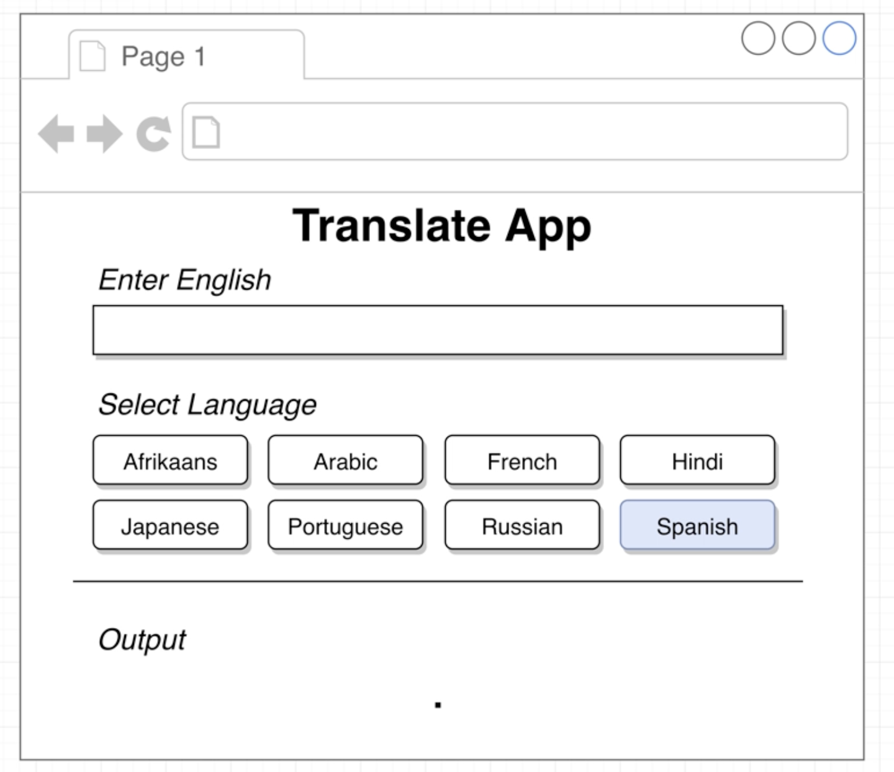
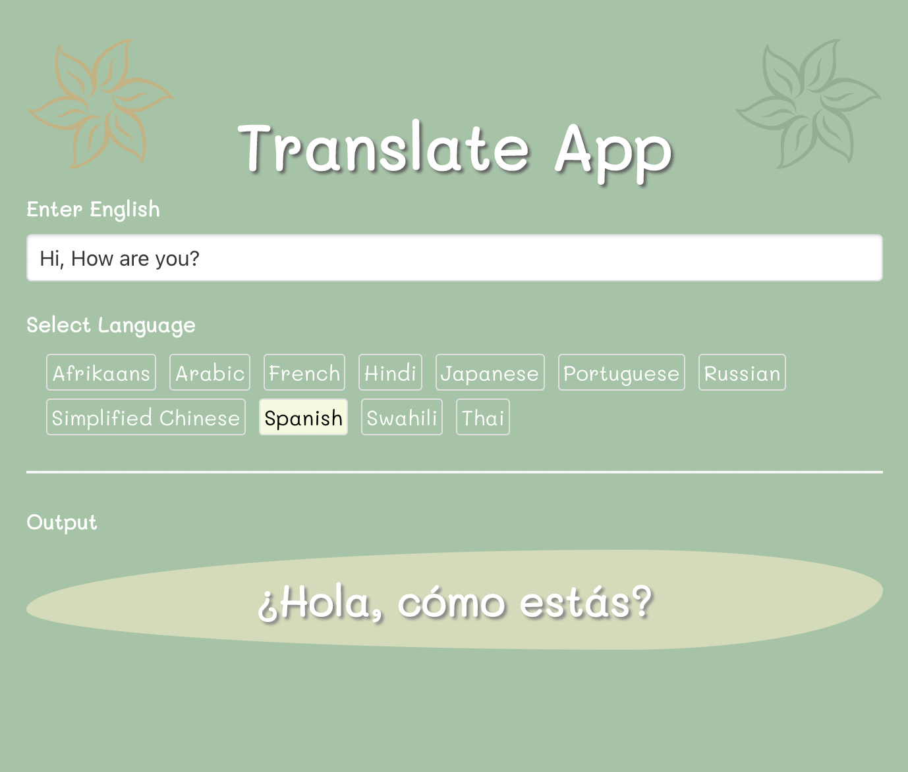

## 01. Let's Dive In

**Video 1: Let's build an App!**

Stephen starts the course by intending to build a _translation app_ that looks something like this. 

We are not interested in understanding the set up of files in the first attempt, so we build this in the sandbox. Some of the files are already created for us. 

ALL the other projects will be created on our computer from scratch. 

**Question Link**: https://codesandbox.io/s/react-pibc94
**Solution Link**: https://codesandbox.io/s/react-forked-m5bz37

The final app looks like this: 

**Video 2: Critical Questions**

